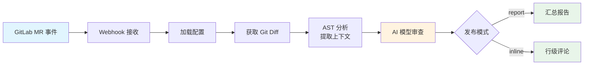

# AI 代码审查工具

基于大语言模型和 GitLab 的自动化代码审查工具。通过 Webhook 监听 MR 事件，利用 AST 分析提取代码上下文，调用 AI 模型识别代码质量问题，并将审查结果自动发布到 GitLab MR 中。

## 快速上手

### GitLab 配置

在 GitLab 中配置 Webhook，使 MR 事件能自动触发代码审查：

**项目 → 设置 → 通用 → 集成**

1. **URL**：`http://gitlab.example.com/webhook/gitlab`
2. **触发器**：勾选 **合并请求事件（Merge request events）**
3. **SSL 验证**：去掉 **启用 SSL 验证** 的勾选

配置完成后，每次创建或更新 MR 时，将自动触发 AI 代码审查。

### 环境变量配置

在部署服务器上配置 `.env` 文件，填写必需的环境变量：

| 变量 | 说明 |
|------|------|
| `GITLAB_TOKEN` | GitLab 访问令牌（需要 `api`、`read_repository` 权限） |
| `CI_API_V4_URL` | GitLab API 地址，例如 `http://gitlab.example.com/api/v4` |
| `OPENAI_API_KEY` | AI 模型 API 密钥（默认使用阿里云百炼平台） |

## 工作流程



1. **触发**：GitLab MR 事件通过 Webhook 推送到审查服务
2. **解析**：获取代码差异，提取新增行号
3. **分析**：AST 解析 JS/TS/Vue 文件，提取包含新增行的最小函数/类块
4. **审查**：构建 Prompt 调用 AI 模型，获取结构化问题报告
5. **发布**：根据配置发布 Markdown 汇总报告或精准行级评论

## 目录结构

```
.
├── src/
│   ├── main.js               # 主审查流程（入口）
│   ├── webhook_server.js      # Webhook HTTP 服务（Express）
│   ├── config.js              # 配置管理（环境变量加载）
│   ├── gitlab_api.js          # GitLab API 交互（获取 diff、发布评论）
│   ├── ai_client.js           # AI 模型调用（OpenAI 兼容接口）
│   ├── review_engine.js       # 审查引擎（并发文件审查）
│   ├── prompt_builder.js      # Prompt 构建（System/User Prompt）
│   ├── report.js              # 报告生成（Markdown / HTML 表格）
│   ├── diff_utils.js          # Git Diff 解析与行号映射
│   ├── json_utils.js          # AI 响应 JSON 提取与校验
│   ├── ast_context.js         # JS/TS/JSX 的 AST 上下文分析
│   ├── ast_context_vue.js     # Vue SFC 的 AST 上下文分析
│   └── ast_utils.js           # AST 工具函数
├── mock/
│   └── gitlab_webhook_merge_request.json  # Webhook 模拟数据
├── .env                       # 环境变量配置
├── .gitlab-ci.yml             # GitLab CI/CD 配置
├── Dockerfile                 # Docker 镜像构建
├── coding_guidelines.yaml     # 编码规范（可自定义）
├── system_prompt.txt          # AI System Prompt 模板
├── debug_local.js             # 本地调试脚本（CI 模式）
├── debug_webhook.js           # 本地调试脚本（Webhook 模式）
└── package.json
```

## 技术特性

- **Webhook 驱动**：通过 HTTP 服务监听 GitLab MR 事件，异步执行审查，避免超时
- **AST 智能分析**：支持 JS/TS/JSX/Vue，提取包含变更行的最小函数/类块作为上下文
- **双模式发布**：汇总报告模式（Markdown）或行级评论模式（精准定位到代码行）
- **并发控制**：通过 `p-limit` 限制并发数，避免 API 速率限制
- **自动清理**：每次审查前删除旧的 AI 评论，保持 MR 界面整洁
- **容错机制**：AST 解析失败时优雅降级，代码块超限自动跳过
- **安全校验**：支持 Webhook Secret Token 验证，Action 白名单过滤

## 技术栈

- **运行时**：Node.js 16+
- **Web 框架**：Express 5
- **AST 解析**：@babel/parser + @babel/traverse、@vue/compiler-sfc
- **HTTP 客户端**：axios
- **AI 接口**：OpenAI 兼容协议（默认阿里云百炼平台）
- **其他**：js-yaml、p-limit、dotenv

## 部署

### Docker 部署

```bash
# 构建镜像
docker build -t ai-code-review .

# 运行容器
docker run -d -p 80:80 --env-file .env ai-code-review
```

### 本地开发

```bash
# 安装依赖
pnpm install

# 启动 Webhook 服务（加载 .env.local）
pnpm run dev

# 模拟 Webhook 请求
pnpm run demo:webhook
```

## 配置参考

### 审查参数

| 变量 | 默认值 | 说明 |
|------|--------|------|
| `OPENAI_BASE_URL` | `https://dashscope.aliyuncs.com/compatible-mode/v1` | AI 模型 API 地址 |
| `REVIEW_MODEL` | `qwen3-coder-plus` | 使用的 AI 模型 |
| `MAX_PARALLEL` | `3` | 并发审查文件数 |
| `ISSUE_LIMIT` | `10` | 单文件问题数限制 |
| `REVIEW_MODE` | `report` | 发布模式：`report` 或 `inline` |
| `ENABLE_AST` | `true` | 是否启用 AST 分析 |
| `DRY_RUN` | `false` | 测试模式，不实际发布评论 |
| `MAX_DIFF_LINES` | `500` | Diff 最大行数限制 |
| `MAX_DIFF_CHARS` | `50000` | Diff 最大字符数限制 |

### AST 配置

| 变量 | 默认值 | 说明 |
|------|--------|------|
| `AST_MAX_SNIPPET_LENGTH` | `10000` | 代码片段最大字符数 |
| `AST_MAX_BLOCK_SIZE_LINES` | `150` | 代码块最大行数 |
| `AST_MAX_DEPTH` | `60` | AST 遍历最大深度 |
| `AST_TIMEOUT_MS` | `8000` | AST 解析超时时间（毫秒） |

### Webhook 配置

| 变量 | 默认值 | 说明 |
|------|--------|------|
| `WEBHOOK_PORT` | `8787` | Webhook 服务端口 |
| `GITLAB_WEBHOOK_SECRET` | 空 | Webhook Secret Token（可选） |
| `WEBHOOK_ALLOWED_ACTIONS` | `open,update,reopen,merge` | 允许触发审查的 MR 动作 |

### 编码规范配置（可选）

在项目根目录创建 `coding_guidelines.yaml` 自定义审查规范：

```yaml
guidelines:
  - id: "VUE-001"
    category: "Vue3"
    severity: "高"
    description: "禁止在同一元素上同时使用 v-for 和 v-if"
    suggestion: "将 v-if 移到外层或使用计算属性过滤数据"

  - id: "JS-001"
    category: "JavaScript"
    severity: "高"
    description: "访问可能为 null/undefined 的属性前必须检查"
    suggestion: "使用可选链 ?. 或先判断"
```
